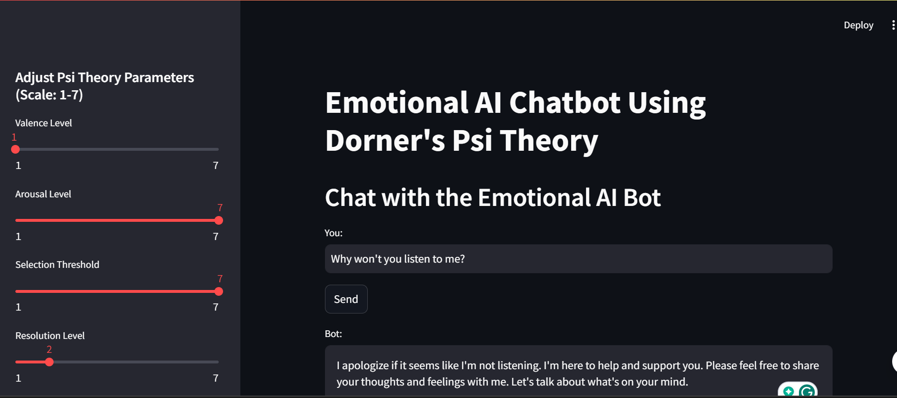
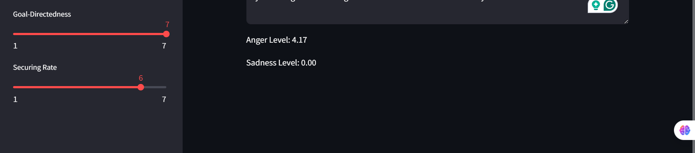

# Emotional AI Chatbot 🚀

Welcome to the **Emotional AI Chatbot** project! This innovative chatbot blends **Dorner's Psi Theory** with conversational AI to simulate emotional intelligence. Dive in to explore how AI adapts to human-like emotions! 🌟

---

## 🧠 Overview

This project brings together psychology and AI, implementing a chatbot that dynamically adjusts its behavior based on simulated emotional states of **anger** and **sadness**. Users can tweak psychological parameters to observe how the chatbot's emotional state changes, making this an exciting tool for understanding emotional AI.

---

## 📂 Project Structure

Here's a breakdown of the key directories and files in the project:

- **`frontend/`**:  
  Contains the **Streamlit** application for user interaction.  
  - `app.py` - The main script for the chatbot's UI.

- **`backend/`**:  
  Houses the **Flask** server that processes user inputs and generates responses.  
  - `server.py` - Handles API requests and emotional state computation.

- **`notebook/`**:  
  Includes Jupyter notebooks for prototyping and development.  
  - `emotional-ai-bot.ipynb` - Documented implementation of the emotional model.

- **`.env`**:  
  Stores environment variables like API keys (**not included in the repository for security reasons**).

---

## ✨ Features

- **🔄 Dynamic Emotional State Calculation:**  
  Real-time computation of anger and sadness levels based on **Dorner's Psi Theory**.

- **🎚️ Adjustable Parameters:**  
  Fine-tune six psychological parameters to influence the chatbot’s emotional state.

- **🗣️ Adaptive Dialogue:**  
  The chatbot adjusts its tone and responses based on its emotional state, offering empathetic, assertive, or neutral replies.

- **📜 Conversation Memory:**  
  Retains conversation context for more relevant and meaningful responses.

---

## 🛠️ How to Use

### 🎛️ Setup

1. **Clone the Repository**:  
   ```bash
   git clone https://github.com/Birkity/emotional-ai-chatbot.git
   cd emotional-ai-chatbot
   ```

2. **Set Up Environment**:  
   - Create a virtual environment:
     ```bash
     python -m venv venv
     source venv/bin/activate  # On Windows, use `venv\Scripts\activate`
     ```
   - Install dependencies:
     ```bash
     pip install -r requirements.txt
     ```

3. **Configure `.env` File**:  
   Create a `.env` file in the root directory with the following:
   ```plaintext
   OPENROUTER_API_KEY=your_api_key_here
   OPENROUTER_BASE_URL=https://openrouter.ai/api/v1
   ```

### 🏃‍♂️ Running the Application

1. **Start the Backend Server**:  
   ```bash
   cd backend
   python server.py
   ```

2. **Run the Frontend**:  
   ```bash
   cd ../frontend
   streamlit run app.py
   ```

3. **Interact with the Chatbot**:  
   Open the URL provided by Streamlit in your browser to start chatting!

---

## 📸 Visuals

### UI Screenshot




---


## 📚 Documentation

- **Notebook**:  
  Detailed implementation of the emotional model, including calculation formulas and initial testing.

- **Backend**:  
  API and logic for emotional state computation and response generation.

- **Frontend**:  
  User interface for adjusting parameters and interacting with the chatbot.

---

## 🤝 Contributing

We welcome contributions to enhance the project! 🎉  
- **Fork** the repository.  
- Create a new **branch** for your feature or fix.  
- Submit a **pull request** with your changes.

Feel free to suggest improvements, report issues, or add new features!

---

## 🙏 Acknowledgments

Special thanks to:  
- **LangChain**: For providing a powerful framework for building conversational AI.  
- **OpenRouter**: For simplifying API access to various AI models.  

---

